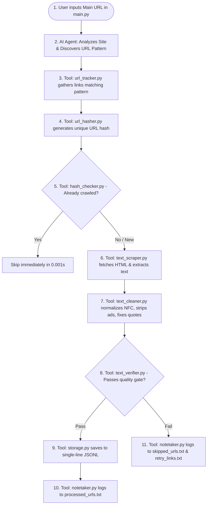

# Autonomous Khmer LLM Data Mining Agent

An intelligent, production-grade autonomous data mining agent designed to scrape, extract, sanitize, and verify high-quality Khmer text data across diverse government and news websites for pre-training Khmer Large Language Models (LLMs).

---

## 1. Project Background and Core Concept

### The Problem (Why This System Was Built)
During earlier data collection runs, each website presented a completely different technical challenge:
* **Inconsistent URL Architecture**:
  * **Ministry of Economy and Finance (MEF)**: Uses `/news/{article-slug}/`
  * **Ministry of Culture and Fine Arts (MCFA)**: Uses `/km/{long-title-slug}/` (no `/news/` indicator)
  * **Ministry of Women's Affairs (MoWA)**: Uses `/detail/{numeric-id}`
* **The Manual Bottleneck**: Standard web scrapers require developers to constantly inspect HTML elements, rewrite regex patterns, and modify Python scripts for every single website. This manual rewriting process severely slowed down dataset collection.
* **Token Quota Limits**: Relying exclusively on paid cloud LLMs (like OpenAI or Gemini) for large-scale crawling causes rate-limiting errors and token exhaustion when processing thousands of pages.

### The Solution: Tool-Calling Autonomous Agent
Instead of writing separate scrapers for each site, this system implements an **Autonomous Tool-Calling Architecture**:
1. **Single Input Principle**: The developer only provides the **Main Homepage URL** (e.g., `https://mcfa.gov.kh`) in `main.py`.
2. **AI as the Brain (Orchestrator)**: The AI Agent inspects candidate links, autonomously discovers the URL patterns of that specific website, and configures the crawler dynamically.
3. **Python Tools as Physical Devices**: Fast, deterministic Python scripts execute the heavy lifting (network calls, parsing, Unicode normalization, hashing, and file I/O).
4. **Pluggable AI Brain**: Can run using **Ollama (Local AI on your machine)** for **100% Free, Unlimited, Offline** execution with zero token cost, or toggle to **Gemini API** with a single line of configuration.
5. **Zero Data Loss Guarantee**: Broken pages, timeouts, or non-Khmer articles are gracefully skipped without crashing the system, and every skipped link is preserved for future inspection or secondary crawlers.

---

## 2. Project and Directory Structure

```text
khmer_mining_agent/
│
├── tools/                         # Core Modular Devices (Python-driven execution)
│   ├── __init__.py                # Clean package exports for all tools
│   ├── url_tracker.py             # Tool 1: Discovers and tracks internal links within domain scope
│   ├── url_hasher.py              # Tool 2: Converts URLs into unique cryptographic hashes (MD5/SHA-256)
│   ├── hash_checker.py            # Tool 3: Ultra-fast cache lookup (0.001s) to prevent duplicate crawling
│   ├── text_scraper.py            # Tool 4: Fast HTTP fetcher + Playwright fallback + Content Extractor
│   ├── text_cleaner.py            # Tool 5: Unicode NFC normalizer, boilerplate and quote cleaner («...»)
│   ├── text_verifier.py           # Tool 6: Quality gatekeeper (Khmer ratio >= 60%, minimum length filter)
│   ├── storage.py                 # Tool 7: Appends verified records to single-line UTF-8 .jsonl files
│   └── notetaker.py               # Tool 8: Manages checkpoint logs (processed, skipped, and retry files)
│
├── records/                       # Persistent Checkpoints and Audit Logs
│   ├── processed_urls.txt         # 1. Successfully scraped and saved URLs
│   ├── skipped_urls.txt           # 2. Detailed audit log of skipped URLs with failure reasons
│   └── retry_links.txt            # 3. Clean raw list of skipped URLs for external system retries
│
├── output/                        # Final Processed Dataset Directory
│   └── 04_government/             # Domain classification folder
│       └── ministries/            # Clean JSONL files (e.g., gov_mcfa.jsonl, gov_mef.jsonl)
│
├── agent.py                       # AI Agent: Autonomous decision maker and pattern discovery engine
├── config.py                      # Configuration: Toggle between Ollama (Local) and Gemini (Cloud)
├── main.py                        # Execution Entrypoint: Simply set TARGET_SITES and run
├── requirements.txt               # Dependency specifications (httpx, bs4, trafilatura, etc.)
├── structure.txt                  # Visual tree breakdown of the project
└── README.md                      # Comprehensive system documentation (this file)
```

---

## 3. End-to-End Workflow and Lifecycle

The lifecycle strictly follows the proven, battle-tested 8-step pipeline:



### Detailed Workflow Stages:

1. **Root URL Input**: You supply only the homepage URL (e.g., `https://mowa.gov.kh`) in `main.py`.
2. **AI Pattern Recognition**: The AI Agent inspects the homepage navigation and candidate links to determine how articles are structured on this specific platform (`/detail/\d+`, `/km/*`, or `/news/*`).
3. **URL Tracking and Discovery**: `url_tracker.py` traverses internal links constrained strictly to the target domain, filtering out social links and static media files.
4. **Pre-Crawl Hashing and Duplicate Rejection**: Before downloading article bodies or rendering pages, `url_hasher.py` and `hash_checker.py` verify whether the URL hash is already recorded in `records/processed_urls.txt`. Duplicates are discarded in under 1 millisecond.
5. **Adaptive Scraping**: `text_scraper.py` attempts rapid HTTP requests first. If client-side JavaScript rendering is detected (e.g., empty container tags), it automatically falls back to Playwright Headless Chromium to capture dynamic content.
6. **Khmer Text Sanitization**: `text_cleaner.py` executes domain-tailored cleaning:
   * Strips promotional noise (Telegram channels, Facebook pages, TikTok links, phone numbers, emails).
   * Unescapes HTML character entities.
   * Deduplicates repeated Khmer vowels and diacritics.
   * Converts standard double quotes (`"..."`) into formal Khmer quotes (`«...»`), preventing escaped backslashes (`\"`) inside JSON output.
   * Enforces Unicode Normalization Form C (NFC).
7. **Strict Quality Verification**: `text_verifier.py` checks that:
   * Content length is >= 150 characters (rejects empty or one-line announcements).
   * Khmer character density is >= 60% (rejects untranslated English press releases).
8. **Storage and Audit Logging**:
   * **Valid articles** are written directly to `output/04_government/ministries/gov_*.jsonl` in single-line format with `ensure_ascii=False`.
   * **Skipped articles** are recorded in `records/skipped_urls.txt` with their failure classification (e.g., `[NOT_ENOUGH_KHMER]`, `[TIMEOUT_ERROR]`, `[TOO_SHORT]`).
   * **Retry Queue**: Raw URLs of skipped items are appended to `records/retry_links.txt` so secondary crawlers or manual inspection tools can process them later without data loss.

---

## 4. Tool and Capability Breakdown

The system packages all **34 production web scraping capabilities** into 8 cohesive tools:

| Category | Industry Capabilities (1 to 34) | Mapped Tool |
| :--- | :--- | :--- |
| **1. Crawling** | 1. URL Normalizer<br>2. URL Frontier / Queue<br>3. Link Discovery<br>4. Link Classifier<br>5. Domain Scope Manager<br>6. Robots Checker<br>7. Crawl Policy | **`tools/url_tracker.py`**<br>+ **`agent.py`** |
| **2. Fetching** | 8. HTTP Fetcher<br>9. Browser Renderer (Playwright Fallback)<br>10. Retry Manager (Exponential Backoff)<br>11. Rate Limiter (Polite Delay)<br>12. Response Validator | **`tools/text_scraper.py`** |
| **3. Understanding** | 13. Page Structure Analyzer<br>14. Page Type Classifier<br>15. Khmer Language Analyzer | **`agent.py`** (AI Brain) |
| **4. Extraction** | 16. Main Content Extractor<br>17. Article Extractor<br>18. Metadata Extractor (Date, Title)<br>19. Table/Text Structure Extractor | **`tools/text_scraper.py`** |
| **5. Khmer Processing** | 20. Unicode Normalizer (NFC)<br>21. Khmer Text Normalizer<br>22. Whitespace Cleaner<br>23. Boilerplate Remover (Telegram, FB, etc.)<br>24. Noise Detector | **`tools/text_cleaner.py`** |
| **6. Quality** | 25. Text Quality Scorer<br>26. Khmer Quality Checker (Ratio >= 60%)<br>27. Content Validator (Length >= 150 chars)<br>28. Duplicate Detector<br>29. Near-Duplicate Detector | **`tools/url_hasher.py`**<br>+ **`tools/hash_checker.py`**<br>+ **`tools/text_verifier.py`** |
| **7. Storage** | 30. Raw HTML Storage<br>31. Clean Text Storage<br>32. Metadata Storage<br>33. Failure Storage (`skipped_urls.txt`)<br>34. Crawl Logs (`processed_urls.txt`) | **`tools/storage.py`**<br>+ **`tools/notetaker.py`** |

---

## 5. How to Run the System

### Prerequisites and Installation
Ensure you have Python 3.10+ installed on your system:

```bash
# 1. Install dependencies
pip install -r requirements.txt

# 2. Install Playwright browser binaries (for dynamic JS pages)
playwright install chromium
```

### Execution: Put Your Target Link in `main.py`
Open `main.py` and specify your target website(s) in the `TARGET_SITES` list:

```python
# main.py
TARGET_SITES = [
    # Simply paste the main homepage URL here:
    "https://mcfa.gov.kh",
    
    # You can also add multiple websites to run sequentially:
    # "https://mef.gov.kh",
    # "https://mowa.gov.kh",
]
```

Run the pipeline:
```bash
python main.py
```

---

## 6. AI Engine Configuration (`config.py`)

Switch between local offline AI and cloud AI with a single variable:

```python
# config.py

# Options: "ollama" (Local, 100% Free, Unlimited) | "gemini" (Google Cloud API)
AI_PROVIDER = "ollama"

# Local Ollama Model Configuration
OLLAMA_MODEL = "llama3.2:3b"  # or "qwen2.5:7b"
OLLAMA_HOST = "http://localhost:11434"

# Cloud Gemini Configuration
GEMINI_API_KEY = "your-api-key-here"
GEMINI_MODEL = "gemini-3.5-flash"
```

---

## 7. Reliability and Fault Tolerance (Zero Crash Guarantee)

* **Resilience Against Network Drops**: The system wraps all network calls in automatic retries with polite randomized delays (0.3s - 1.0s) to prevent IP rate-limiting.
* **Server Error Handling**: If a target site suffers a 404, 500, or gateway timeout, the error is caught, logged to `records/skipped_urls.txt`, and the crawler immediately transitions to the next link.
* **Power Failure Recovery (Checkpointing)**: If your computer reboots or loses power, simply rerun `python main.py`. The agent reads `records/processed_urls.txt` and seamlessly resumes where it stopped without downloading duplicate records.
